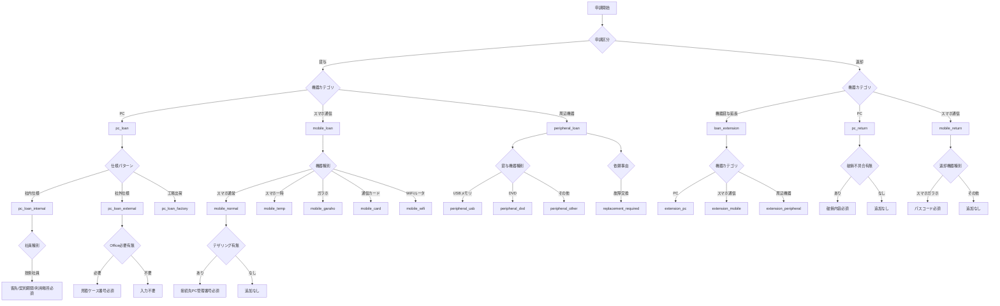

# 申請ツール 機能要件

## 1. 申請フロー

### 事前ヒアリング（フォーム誘導）

申請開始時に簡易ヒアリングを行い、内容に応じて適切なフォームへ誘導する。

| ヒアリング項目 | 分岐内容 |
|----------------|----------|
| 申請種別 | 貸与 / 返却 |
| 機器種別 | PC / 通信機器 / 周辺機器 |
| 申請台数 | 1台（通常フォーム）/ 複数台（大量申請フォームへ分岐） |
| 申請理由の概要 | 新規入社 / プロジェクト / 故障交換 / その他 |

### 一括返却申請

退職・休職など複数機器を同時に返却するケースに対応するため、1回の申請でPC・通信機器・周辺機器をまとめて申請できる一括返却フォームを用意する。申請項目はSalesforceのITサービス依頼の項目に依存する。

| 項目 | 内容 |
|------|------|
| 対象 | 複数機器種別をまとめて返却するケース（退職・休職・契約終了など） |
| 方式 | 1フォーム内で返却する機器種別をチェック選択し、選択した種別ごとに項目を表示 |
| 共通項目 | 申請者情報・返却理由・発送日・伝票番号は全機器共通で1回入力 |
| 機器別項目 | 選択した機器種別ごとに固有の入力欄を表示（資産管理番号・付属品等） |
| SF連携 | 一括申請完了時にSalesforceへ一括で書き込み |

### 入力項目（共通）

| 項目 | 備考 |
|------|------|
| 申請者情報 | 氏名・社員番号（EntraIDから自動取得） |
| 利用者情報 | 氏名・社員番号（申請者と異なる場合） |
| 納品先 | 社内拠点のみ（自宅不可） |
| 希望納品日 | 申請日から1ヶ月以内のみ受付 |

### 下書き保存（一時保存）

| 項目 | 内容 |
|------|------|
| 保存タイミング | ①手動保存（「下書き保存」ボタン）②デバウンス自動保存（入力が止まって1分後）③ステップ移動時（「次へ」「戻る」押下時）の3タイミングで保存 |
| 保存先 | サーバーサイドDB（EntraIDユーザーIDに紐づけて保存） |
| 保存期間 | 1週間（期限切れで自動削除） |
| 参照 | 申請者本人のみ。ログイン後に「下書きを再開しますか？」のバナーを表示 |
| 複数下書き | 同一ユーザーが複数の下書きを持てる（申請種別・作成日時で一覧表示） |
| 削除 | 本人が任意に削除可能。期限切れは自動削除 |
| 注意 | localStorageは使用しない（ブラウザ依存・セキュリティリスクのため） |

### バリデーション

#### 基本方針

- **クライアント側**：React Hook Form を使用し、フィールド単位でリアルタイムに検証
- **サーバー側**：Next.js API Routes（または App Router の Server Actions）で同一ルールを再検証。クライアント側バリデーションは UX 改善のための補助であり、サーバー側が正とする
- **タイミング**：フォーカスが外れた時点（onBlur）でエラー表示。送信ボタン押下時に全項目を一括再検証

#### エラー表示ルール

| 表示場所 | 内容 |
|---------|------|
| フィールド直下 | 赤字で具体的なエラー理由を表示（例：「社員番号は必須です」「8桁の数字で入力してください」） |
| ステップ移動時 | 未入力・エラーがある場合はステップ先へ進めず、該当フィールドへ自動スクロール |
| 送信前確認画面 | 全項目を表示し、問題がある項目をハイライト |
| Toast通知 | 送信成功・失敗・保存完了をページ右上にToastで通知（3秒で自動消滅） |

#### フィールド別バリデーション詳細

| フィールド | ルール | エラーメッセージ |
|-----------|--------|----------------|
| 社員番号 | 必須・数字のみ・桁数チェック（TBD） | 「社員番号は必須です」「半角数字で入力してください」 |
| 希望納品日 | 必須・今日以降・1ヶ月以内 | 「希望納品日を入力してください」「本日から1ヶ月以内の日付を入力してください」 |
| 送付先 | 必須・個人宅不可（マスタ照合） | 「送付先を選択してください」「個人宅への配送には対応していません」 |
| 用途/理由 | 必須・最低文字数（TBD） | 「利用理由を入力してください」「具体的な内容を〇〇文字以上で入力してください」 |
| 契約期間 | 技術社員の場合は必須・日付形式 | 「契約期間を入力してください」 |
| 客先 | 技術社員の場合は必須 | 「客先を入力してください」 |
| 管理者権限の理由 | 管理者権限=有 の場合は必須 | 「管理者権限が必要な理由を入力してください」 |
| パスコード（返却時） | スマホ・ガラホ返却時は必須 | 「端末のパスコードを入力してください（初期化処理に必要です）」 |
| 破損内容 | 破損ありの場合は必須・写真添付 | 「破損・不具合の内容を記入してください」「写真を1枚以上添付してください」 |

#### 申請不可条件（ブロック系）

以下はサーバー側で検証し、条件を満たさない場合は送信エラーとして返す。

| 条件 | エラー内容 | 対応 |
|------|-----------|------|
| 必須情報不足 | 資産管理に必要な項目が未入力 | 該当フィールドへ誘導 |
| 個人宅送付 | 送付先が対応外の住所 | 「対応可能な拠点を選択してください」と代替選択肢を提示 |
| 期限超過 | 希望納品日が申請日から1ヶ月超 | 「希望納品日は申請日から1ヶ月以内で入力してください」 |
| 大量申請 | 一定台数以上（基準TBD） | 大量申請フォームへ分岐し理由の詳細入力または情シスへの事前確認を必須とする |
| 連続申請 | 同一申請者の短期間連続申請 | ブロックせず監査ログに記録しアラートで検知 |

### 機器別 貸与判定分岐

#### PC

| 分類軸 | 分岐内容 |
|--------|----------|
| 社員属性（職種） | 管理社員／技術社員／その他 |
| 社員属性（雇用形態） | 役員／一般社員／派遣社員／外部委託 |
| M365ライセンス | 上記属性の組み合わせで決定（詳細TBD） |
| ネットワーク利用 | 社内のみ／社内＋外部／外部のみ |
| 備考 | 技術社員は顧客ネットワーク環境での利用ケースあり |

#### 通信機器（スマホ・モバイルWi-Fi）

| 分類軸 | 分岐内容 |
|--------|----------|
| カメラ | あり／なし |
| アカウント種別 | 個人特定アカウント／個人特定しないアカウント |

#### 周辺機器（マウス・ヘッドセット・ケーブル・モニター・キーボード等）

- 貸与・返却の記録のみ。詳細な分岐なし。

### 申請項目一覧

各申請種別のフォーム入力欄・選択肢。

#### PC貸与

**共通項目**

| 申請項目 | 内容・選択肢 | 必須/任意 |
|---------|------------|---------|
| 申請者（利用者）氏名 | テキスト入力 | 必須 |
| 社員番号 | テキスト入力 | 必須 |
| 機器貸与経費負担部署名 | テキスト入力 | 必須 |
| 機器貸与経費部門コード | テキスト入力 | 必須 |
| 貸与品種別 | 選択：デスクトップPC / ノートPC | 必須 |
| 社員種別 | 選択：管理社員 / 技術社員 | 必須 |
| 仕様パターン | 選択：社内仕様 / 社外仕様 / 工場出荷 | 必須 |
| 使用パターン | 選択：社内用 / 社外用 | 必須 |
| ノートPC用追加モニタ | 選択：有 / 無 | 任意 |
| 貸与期間（利用開始予定日） | 日付入力 | 必須 |
| 貸与期間（利用終了予定日） | 日付入力 | 任意（客先利用・研修など期間が決まる場合は必須） |
| 送付先情報 | テキスト入力（個人宅不可） | 必須 |
| Microsoft Officeエディション | 選択：STD / Pro / Office無し / Office（その他） | 必須 |
| 用途/理由 | テキスト入力（詳細記載） | 必須 |

**社内仕様の追加項目**

| 申請項目 | 内容・選択肢 | 必須/任意 |
|---------|------------|---------|
| 客先 | テキスト入力 | 必須（技術社員・受託/構内請負の場合） |
| 契約期間 | テキスト入力 | 必須（技術社員の場合） |
| 機器利用場所 | テキスト入力 | 必須（技術社員の場合） |
| ご利用用途の詳細 | テキスト入力（どのように利用するか具体的に） | 必須 |
| 管理者権限の有無と必須理由 | テキスト入力（有の場合は理由必須） | 必須 |

**社外仕様の追加項目**

| 申請項目 | 内容・選択肢 | 必須/任意 |
|---------|------------|---------|
| 客先 | テキスト入力 | 必須 |
| 契約期間 | テキスト入力 | 必須 |
| 機器利用場所 | テキスト入力 | 必須 |
| ご利用用途の詳細 | テキスト入力 | 必須 |
| 社外仕様PC必須理由 | テキスト入力（客先ネットワーク接続が必要な理由） | 必須 |
| CYNCSのプロジェクト番号 | テキスト入力 | 必須 |
| Office見積取得ケース番号 | テキスト入力 | Office必要時は必須 |

**派遣先要請の追加項目**

| 申請項目 | 内容・選択肢 | 必須/任意 |
|---------|------------|---------|
| 覚書締結の有無 | 選択：締結済み / 未締結 | 必須 |
| CSR推進部 景山次長の承認 | レビュー承認取得 | 必須 |
| 取引先請求の有無 | 選択：あり / なし | 任意 |

---

#### PC返却

**共通項目**

| 申請項目 | 内容・選択肢 | 必須/任意 |
|---------|------------|---------|
| 申請者氏名 | テキスト入力 | 必須 |
| 返却機器の資産管理番号（OIR番号） | テキスト入力 | 必須 |
| 返却理由 | 選択：退職 / 休職 / 契約終了 / 不要 / その他 | 必須 |
| 発送日 | 日付入力 | 必須（発送後に記入） |
| 伝票番号 | テキスト入力 | 必須（発送後に記入） |
| 付属品の有無 | チェック（電源アダプタ、マウス等） | 必須 |

**破損・不具合がある場合の追加項目**

| 申請項目 | 内容・選択肢 | 必須/任意 |
|---------|------------|---------|
| 破損・不具合内容 | テキスト入力（写真添付） | 必須（破損ありの場合） |
| リスクマネジメント報告書のケース番号 | テキスト入力 | 落下・水こぼし等の場合は必須 |

---

#### スマホ・通信機器貸与

**共通項目**

| 申請項目 | 内容・選択肢 | 必須/任意 |
|---------|------------|---------|
| 申請者（利用者）氏名 | テキスト入力 | 必須 |
| 社員番号 | テキスト入力 | 必須（通常仕様は必須、一時貸与は任意） |
| 社員種別 | 選択：管理社員 / 技術社員 | 必須 |
| 機器種別 | 選択：スマホ（通常）/ スマホ（一時貸与）/ ガラホ / 通信カード / Wi-Fiルータ | 必須 |
| 機器貸与経費負担部署名 | テキスト入力 | 必須 |
| 機器貸与経費部門コード | テキスト入力 | 必須 |
| 用途/理由 | テキスト入力 | 必須 |
| 利用開始予定日 | 日付入力 | 必須 |
| 利用終了予定日 | 日付入力 | 客先利用・研修等は必須 |
| 送付先情報 | テキスト入力（個人宅不可） | 必須 |

**技術社員（受託/構内請負）の追加項目**

| 申請項目 | 内容・選択肢 | 必須/任意 |
|---------|------------|---------|
| 客先 | テキスト入力 | 必須 |
| 契約期間 | テキスト入力 | 必須 |
| 機器使用場所 | テキスト入力 | 必須 |
| メールアプリ利用の有無 | 選択：利用あり（通常仕様）/ 利用なし（OWA・一時貸与仕様） | 必須 |
| テザリング利用の有無 | 選択：あり / なし | 必須 |
| テザリングで接続するPCの資産管理番号 | テキスト入力 | テザリングありの場合は必須 |
| 使い回し（複数人利用）の予定 | 選択：あり / なし | 必須 |

**派遣先要請の追加項目**

| 申請項目 | 内容・選択肢 | 必須/任意 |
|---------|------------|---------|
| 派遣先要請の有無 | 選択：あり / なし | 必須 |
| 客先より貸与いただけない理由 | テキスト入力 | 派遣先要請の場合は必須 |
| 覚書締結の有無 | 選択：締結済み / 未締結 | TCS以外の派遣先要請は必須 |
| CSR推進部 景山次長の承認 | レビュー承認取得 | 派遣先要請の場合は必須 |

**ガラホ貸与の追加項目**

| 申請項目 | 内容・選択肢 | 必須/任意 |
|---------|------------|---------|
| ガラホ選択理由 | 選択：通話のみの利用 / 客先構内カメラ持ち込み禁止 | 必須 |
| テザリング利用の有無 | 選択：あり（オプション追加、2GB/月）/ なし | 任意 |

---

#### スマホ・通信機器返却

| 申請項目 | 内容・選択肢 | 必須/任意 |
|---------|------------|---------|
| 申請者氏名 | テキスト入力 | 必須 |
| 返却機器の種別 | 選択：スマホ / ガラホ / ガラケー / 通信カード / Wi-Fiルータ | 必須 |
| 返却機器の資産名（SP番号等） | テキスト入力 | 必須 |
| 返却機器の管理番号（電話番号） | テキスト入力 | 必須 |
| 返却理由 | 選択：退職 / 休職 / 契約終了 / 不要 / その他 | 必須 |
| 発送日 | 日付入力 | 必須（発送後に記入） |
| 伝票番号 | テキスト入力 | 必須（発送後に記入） |
| 利用者が設定したパスコード | テキスト入力 | 必須（スマホ・ガラホの場合） |
| 付属品の有無 | チェック（正箱、イヤホン、ケーブル、USBアダプタ等） | 必須 |

---

#### 周辺機器貸与

**共通項目**

| 申請項目 | 内容・選択肢 | 必須/任意 |
|---------|------------|---------|
| 申請者（利用者）氏名 | テキスト入力 | 必須 |
| 社員番号 | テキスト入力 | 必須 |
| 社員種別 | 選択：管理社員 / 技術社員 | 必須 |
| 機器貸与経費負担部署名 | テキスト入力 | 必須 |
| 貸与機器種別 | 選択：マウス / ヘッドセット / HDMIケーブル / WEBカメラ / モニタ / ACアダプタ / USBメモリ / DVDプレイヤー / USB Type-C変換アダプタ / その他 | 必須 |
| 依頼事由 | 選択：新規貸与 / 故障交換 / 障害対応 | 必須 |
| 送付先情報 | テキスト入力（個人宅不可） | 必須 |
| 用途/理由 | テキスト入力 | 必須 |
| 利用開始予定日 | 日付入力 | 必須 |
| 利用終了予定日 | 日付入力（最長1年） | 客先利用等は必須 |

**技術社員の追加項目**

| 申請項目 | 内容・選択肢 | 必須/任意 |
|---------|------------|---------|
| 客先 | テキスト入力 | 必須（派遣・受託・構内請負の場合） |
| 契約期間 | テキスト入力 | 必須 |
| 機器使用場所 | テキスト入力 | 必須 |

**USBメモリ貸与の追加項目**

| 申請項目 | 内容・選択肢 | 必須/任意 |
|---------|------------|---------|
| 利用用途 | テキスト入力 | 必須 |
| 客先 | テキスト入力 | 必須 |
| 利用期限 | 日付入力（最長1年） | 必須 |
| 接続するPCの管理番号 | テキスト入力 | 必須 |
| 暗号化の要否 | 選択：暗号化あり / 暗号化なし | 必須 |

**故障交換の追加項目**

| 申請項目 | 内容・選択肢 | 必須/任意 |
|---------|------------|---------|
| 故障機器の資産管理番号 | テキスト入力 | 必須 |
| ヘルプデスクチケット番号（CS番号） | テキスト入力 | 必須（モニタ・ACアダプタ等） |
| 利用座席 | テキスト入力 | モニタ故障の場合は必須 |

---

#### 周辺機器返却

| 申請項目 | 内容・選択肢 | 必須/任意 |
|---------|------------|---------|
| 申請者氏名 | テキスト入力 | 必須 |
| 返却機器種別 | 選択：マウス / ヘッドセット / HDMIケーブル / WEBカメラ / モニタ / ACアダプタ / USBメモリ / DVDプレイヤー / USB Type-C変換アダプタ / その他 | 必須 |
| 返却機器の資産管理番号 | テキスト入力 | 必須 |
| 返却理由 | 選択：退職 / 休職 / 契約終了 / 不要 / その他 | 必須 |
| 発送日 | 日付入力 | 必須（発送後に記入） |
| 伝票番号 | テキスト入力 | 必須（発送後に記入） |
| 付属品の有無 | チェック（ケーブル・付属品等） | 任意 |
| 破損・不具合の有無 | 選択：あり / なし | 必須 |
| 破損・不具合内容 | テキスト入力（写真添付） | 破損ありの場合は必須 |

---

#### 申請種別ごとの主な分岐条件

| 申請種別 | 主な分岐条件 |
|---------|------------|
| PC貸与 | 社内仕様 / 社外仕様 / 工場出荷 の選択により追加項目が異なる |
| PC貸与 | 管理社員 / 技術社員 の違いにより貸与可否・タスク選択肢が異なる |
| PC貸与 | 技術社員：受託・構内請負 / 派遣 / リーダー業務用 で仕様と期限設定が変わる |
| スマホ貸与 | メールアプリ利用あり → 通常仕様 / 利用なし（OWA）→ 一時貸与仕様 |
| 周辺機器貸与 | 技術社員への新規貸与は原則不可（例外：障害対応・故障交換・一部の外部機器） |

---

### 申請フォーム項目ツリー

申請時の入力漏れ防止とフォーム分岐実装の共通仕様。

#### 全体ルート（最初の分岐）

1. 申請区分を選択
   - 貸与
   - 返却（機器貸与延長を含む）
2. 機器カテゴリを選択
   - PC
   - スマホ・通信機器
   - 周辺機器
3. 上記の組み合わせで画面フローを決定

#### 業務ツリー

**貸与フロー**

- PC貸与
  - `仕様パターン` 分岐：社内仕様 / 社外仕様 / 工場出荷
  - `社員種別=技術社員` の場合：客先/契約期間/機器利用場所が追加必須
  - `ノートPC` の場合：追加モニタ有無を確認
  - `Office必要` の場合：見積ケース番号必須（社外仕様等）
  - `派遣先要請` の場合：覚書締結/承認確認へ分岐

- スマホ・通信機器貸与
  - `機器種別` 分岐：スマホ（通常）/ スマホ（一時貸与）/ ガラホ / 通信カード / Wi-Fiルータ
  - `社員種別=技術社員` の場合：客先/契約期間/機器使用場所/テザリング等を追加
  - `テザリングあり` の場合：接続先PC資産管理番号必須
  - `派遣先要請あり` の場合：理由/覚書/承認を追加
  - `ガラホ` の場合：ガラホ選択理由を必須化

- 周辺機器貸与
  - `貸与機器種別` 分岐：USBメモリ / DVDプレイヤー / その他
  - `依頼事由` 分岐：新規貸与 / 故障交換 / 障害対応
  - `社員種別=技術社員` の場合：客先/契約期間/機器使用場所を追加
  - `USBメモリ` の場合：接続PC管理番号/暗号化要否等を追加
  - `故障交換` の場合：故障資産番号/CS番号等を追加

**返却フロー**

- 機器貸与延長
  - 共通項目：対象機器番号/現在の貸与期限/延長後期限/延長理由
  - `社外仕様PC` の場合：延長理由詳細を必須化

- PC返却
  - 共通項目：OIR番号/返却理由/発送日/伝票番号/付属品
  - `破損・不具合あり` の場合：破損内容（写真添付）・リスクマネジメント報告書ケース番号必須

- スマホ・通信機器返却
  - 共通項目：機器種別/SP番号/電話番号/返却理由/発送情報
  - `機器種別=スマホ or ガラホ` の場合：利用者パスコード必須

#### 実装フローチャート



#### 条件付き必須ルール（バリデーション実装用）

**貸与**

| 条件 | 必須項目 |
|------|---------|
| loan + pc + 技術社員 | 客先・契約期間・機器利用場所 |
| loan + pc + 社外仕様 | 社外仕様PC必須理由・CYNCSプロジェクト番号 |
| loan + pc + Office必要 | Office見積取得ケース番号 |
| loan + pc + 派遣先要請 | 覚書締結の有無・CSR推進部承認 |
| loan + mobile + 技術社員 | 客先・契約期間・機器使用場所・メール利用有無・テザリング有無・使い回し予定 |
| loan + mobile + テザリング=あり | テザリング接続PC資産管理番号 |
| loan + mobile + 派遣先要請 | 貸与いただけない理由・CSR推進部承認 |
| loan + mobile + ガラホ | ガラホ選択理由 |
| loan + peripheral + 技術社員 | 客先・契約期間・機器使用場所 |
| loan + peripheral + USBメモリ | 利用用途・客先・利用期限・接続PC管理番号・暗号化要否 |
| loan + peripheral + DVDプレイヤー | 利用用途・利用期限・読み込み/書き込み要件 |
| loan + peripheral + 故障交換 | 故障機器資産管理番号・CS番号（モニタ等）・利用座席（モニタ故障） |

**返却**

| 条件 | 必須項目 |
|------|---------|
| return + extension | 対象機器番号・現在の貸与期限・延長後利用終了予定日・延長理由 |
| return + extension + PC社外仕様 | 延長理由詳細 |
| return + pc | OIR番号・返却理由・発送日・伝票番号・付属品有無 |
| return + pc + 破損あり | 破損・不具合内容（落下/水こぼし等はリスクマネジメント報告書ケース番号も必須） |
| return + mobile | 機器種別・資産名・管理番号・返却理由・発送日・伝票番号・付属品有無 |
| return + mobile + スマホ/ガラホ | 利用者パスコード |

#### 画面ステップ設計

| Step | 内容 |
|------|------|
| Step 1 | 申請区分・機器カテゴリを選択 |
| Step 2 | 共通項目を表示 |
| Step 3 | 分岐条件項目を表示（社員種別/仕様パターン/機器種別/依頼事由等） |
| Step 4 | 条件付き必須項目を動的表示 |
| Step 5 | 確認画面で「不足項目」「NG遷移」を明示 |
| Step 6 | 送信（サーバー側で同一ルール再検証） |

#### 業務制約

- 送付先情報は個人宅不可（バリデーション：住所判定ルールを実装。暫定は注意喚起＋管理者レビュー）

---

## 2. 認証フロー

### 技術方針

| 項目 | 内容 |
|------|------|
| 認証ライブラリ | NextAuth.js（Auth.js）の Azure AD プロバイダーを使用 |
| 認証方式 | OIDC（OpenID Connect）リダイレクト方式 |
| セッション管理 | JWT セッション（stateless）またはDBセッション（TBD） |

### ログインフロー

```
① ユーザーがアプリにアクセス
      ↓
② 未認証の場合 → /login へリダイレクト
      ↓
③ /login → Entra ID 認可エンドポイントへリダイレクト
      ↓
④ Entra ID でユーザー認証（社内VPN経由のみ許可）
      ↓
⑤ 認証成功 → アプリのコールバックURLへリダイレクト（認可コード付き）
      ↓
⑥ NextAuth.js がコードをトークン（IDトークン・アクセストークン）に交換
      ↓
⑦ セッション生成 → 元のURLへリダイレクト
```

### セッション管理

| 項目 | 内容 |
|------|------|
| セッション有効期間 | 8時間（業務時間に合わせる） |
| 自動延長 | 操作中は自動延長。30分無操作でタイムアウト警告を表示 |
| タイムアウト時 | 「セッションが切れました。再ログインしてください」を表示し `/login` へリダイレクト。入力中の内容は下書き保存してから遷移 |
| 強制ログアウト | ブラウザを閉じてもセッションは保持（有効期間内は再認証不要） |
| ログアウト | Entra ID 側のセッションも合わせて破棄 |

### アクセス制御

| 条件 | 挙動 |
|------|------|
| 未認証でアクセス | `/login` へリダイレクト。ログイン後に元のURLへ戻る |
| 申請者が `/admin` にアクセス | 403エラー画面を表示 |
| 管理者以外が管理系APIを叩く | 401/403を返す（Next.js Middleware で制御） |
| VPN外からのアクセス | Entra ID の条件付きアクセスポリシーでブロック |

### トークン利用

| トークン | 用途 |
|---------|------|
| IDトークン | ユーザー情報（氏名・社員番号・メール）の取得 |
| アクセストークン | Microsoft Graph API 呼び出し（社員情報・EntraIDグループ取得） |
| リフレッシュトークン | セッション有効期間内のトークン自動更新 |

---

## 3. 通知

通知方式はメールのみ（現行システムと同じ挙動を維持）。SalesforceのDBとAPIで連携するため、SF側のメール機能はトリガーされない。新システム側でメール送信を実装する。

| タイミング | 送信先 | 内容 |
|------------|--------|------|
| 申請完了時 | 申請者・情報システム部 | 受付完了通知 |
| 対応完了時 | 申請者 | 対応完了通知 |
| 異常検知時 | システム管理者 | 不正アクセス・大量申請アラート |
| フォールバック発生時 | システム管理者 | ITAM・マスタデータ取得失敗によるフォールバック発生通知（申請者・申請日時・対象項目を含む） |

| 項目 | 内容 |
|------|------|
| 送信方式 | Microsoft Graph API（M365）またはSMTP |
| 送信元 | （詳細TBD） |

## 4. 画面・UI

### 技術スタック

| 項目 | 内容 |
|------|------|
| フレームワーク | Next.js（App Router）+ React |
| スタイリング | Tailwind CSS（レスポンシブ対応のため） |
| フォーム管理 | React Hook Form + Zod（バリデーションスキーマ） |
| Microsoft系ツール | Fluent UI採用の余地あり（EntraID連携との親和性） |

### レスポンシブ対応

| ブレークポイント | 対応内容 |
|---------------|---------|
| モバイル（〜767px） | 1カラム・フルワイド。ボタン類は画面下部に固定 |
| タブレット（768〜1023px） | 1〜2カラム切替。サイドバーは折りたたみ |
| デスクトップ（1024px〜） | 2カラム。サイドバー常時表示 |

### 画面一覧

| 画面 | パス | 対象 | 概要 |
|------|------|------|------|
| ログイン | `/login` | 全員 | EntraIDへリダイレクト |
| トップ / 申請開始 | `/` | 申請者 | 下書き一覧・新規申請ボタン |
| 事前ヒアリング | `/apply/start` | 申請者 | 申請種別・機器カテゴリ選択 |
| 申請フォーム | `/apply/[type]/[step]` | 申請者 | ステップ形式の申請入力 |
| 申請確認 | `/apply/[type]/confirm` | 申請者 | 入力内容の最終確認 |
| 申請完了 | `/apply/complete` | 申請者 | 完了メッセージ・受付番号 |
| 管理ダッシュボード | `/admin` | 管理者 | KPI・申請件数・機器種別集計 |
| 申請一覧（管理者） | `/admin/applications` | 管理者 | 申請件数からドリルダウンした一覧 |
| 申請詳細（管理者） | `/admin/applications/[id]` | 管理者 | 申請内容の詳細確認 |
| 機器種別一覧（管理者） | `/admin/devices` | 管理者 | 機器種別ごとの申請一覧 |
| 申請ステータス確認 | `/my/[id]` | 申請者 | フェーズ2で検討 |

### 管理ダッシュボード詳細

#### KPIカード

| KPI | 内容 | 遷移先 |
|-----|------|--------|
| 申請件数（本日） | 当日の申請総数 | `/admin/applications?date=today` |
| 申請件数（今月） | 当月累計 | `/admin/applications?period=month` |
| 申請件数（期間指定） | 任意期間の申請数 | `/admin/applications?period=custom` |
| 機器種別ごとの件数 | PC / スマホ・通信機器 / 周辺機器 別の件数 | `/admin/devices` |

- KPIカードをクリックすると対象の申請一覧へドリルダウン

#### 申請一覧

| 項目 | 内容 |
|------|------|
| 表示カラム | 受付番号・申請日時・申請者名・機器種別・申請種別 |
| 絞り込み | 申請日・申請者名・社員番号・機器種別 |
| ソート | 申請日時（デフォルト降順） |
| 詳細 | 行クリックで申請詳細画面へ遷移 |
| CSV出力 | 現在の絞り込み条件で全件をCSV出力 |

#### 機器種別一覧

| 項目 | 内容 |
|------|------|
| 表示 | 機器種別ごとにタブ切替（PC / スマホ・通信機器 / 周辺機器） |
| カラム | 受付番号・申請日時・申請者名・申請種別（貸与/返却）・詳細 |
| 詳細 | 行クリックで申請詳細画面へ遷移 |

### ステップウィザード設計

申請フォームはステップ形式（Step 1〜6）で構成し、進捗をページ上部のプログレスバーで可視化する。

```
[Step 1] 事前ヒアリング → [Step 2] 共通項目 → [Step 3] 種別固有項目
→ [Step 4] 条件付き追加項目 → [Step 5] 確認画面 → [Step 6] 完了
```

| 設計ルール | 内容 |
|-----------|------|
| ステップ移動 | 現ステップのバリデーションをパスしないと「次へ」押下不可 |
| 戻る | いつでも前ステップへ戻れる。入力済み内容は保持 |
| プログレスバー | ステップ番号・ステップ名・現在位置を常時表示 |
| URLとステップ同期 | `/apply/[type]/[step]` でURLが変わるため、ブラウザバック対応 |
| 離脱警告 | 未保存の変更がある状態でページ遷移しようとした場合に確認ダイアログを表示 |
| スキップ不可 | ステップは必ず順番に進む。完了ステップへの直接アクセスは不可 |

### UIこだわりポイント

| ポイント | 内容 |
|---------|------|
| **フィールドの動的表示** | 条件付き項目は選択後にスムーズに表示（CSSトランジション）。突然の表示変化でユーザーを混乱させない |
| **入力補完** | 社員番号入力後にEntraID/マスタからユーザー情報を自動補完（氏名・部署をその場で表示し確認させる） |
| **プライマリ操作の明確化** | 「次へ」「送信」ボタンは目立つ色・サイズで右側固定。「戻る」は左側に配置 |
| **確認画面** | 送信前に全入力内容を読みやすいレイアウトで一覧表示。各セクションに「修正」リンクを設置 |
| **完了画面** | 受付番号・次のステップ（いつ連絡が来るか）を明示。スクリーンショット促進 |
| **Toast通知** | 下書き保存完了・エラーをページ右上にToastで表示（アクションを邪魔しない） |
| **ローディング状態** | API呼び出し中はボタンをdisabledにしスピナーを表示（二重送信防止） |
| **モバイル操作性** | フォームの「次へ」「送信」ボタンはモバイル時に画面下部へ固定表示 |
| **エラー表示** | エラーはフィールド直下に赤文字で表示。エラーがある場合はフィールドのボーダーも赤に変化 |
| **空状態** | 下書き一覧・管理ダッシュボードにデータがない場合は適切なemptyステートを表示 |

## 5. ファイル添付

### 対象シーン

| シーン | 内容 |
|--------|------|
| PC返却（破損・不具合あり） | 破損箇所の写真を1枚以上添付必須 |
| その他 | 将来的な拡張に備えて汎用的に実装 |

### 仕様

| 項目 | 内容 |
|------|------|
| 対応形式 | JPEG・PNG・HEIC（スマホ撮影を考慮） |
| ファイルサイズ上限 | 1ファイルあたり10MB |
| 添付枚数 | 最大5枚 |
| アップロード先 | S3 または Azure Blob Storage（Presigned URL方式） |
| プレビュー | アップロード後にサムネイル表示。削除ボタンで個別削除可能 |
| 下書き保存との連携 | 添付ファイルも下書き保存の対象。一時保存フォルダに格納し、申請完了時に正式フォルダへ移動 |
| 未提出ファイルの削除 | 下書き期限切れ（1週間）で添付ファイルも合わせて削除 |

### UIこだわりポイント

| ポイント | 内容 |
|---------|------|
| ドラッグ＆ドロップ | PC操作時はD&Dでアップロード可能 |
| モバイル対応 | スマホからカメラ直接起動またはギャラリー選択 |
| アップロード進捗 | ファイルごとにプログレスバーを表示 |
| エラー表示 | サイズ超過・非対応形式は即時エラー表示 |

---

## 6. エラーハンドリング

### 基本方針

ユーザーに見せるエラーと内部ログに残すエラーを分離する。ユーザーには「何が起きたか・次に何をすべきか」を必ず伝える。

### 外部連携エラー

| 連携先 | エラー内容 | ユーザーへの表示 | 内部処理 |
|--------|-----------|----------------|---------|
| Salesforce | 申請完了時の書き込み失敗 | 「申請は受け付けましたが、連携処理に問題が発生しました。情報システム部へ自動通知済みです。」 | リトライキューに積む（最大5回）。失敗継続時は管理者へメール通知 |
| ITAM | フォーム入力時の資産情報取得失敗 | 「資産情報の取得に失敗しました。手動で入力してください。（入力は任意です）」 | エラーログに記録。手動入力へフォールバック。ITAMから自動入力されるはずだった項目を任意に切り替え。管理者へフォールバック発生をメール通知 |
| マスタデータ | 社員情報・納品先マスタ取得失敗 | 「情報の取得に失敗しました。手動で入力してください。（入力は任意です）」 | エラーログに記録。手動入力へフォールバック。マスタから自動入力されるはずだった項目を任意に切り替え。管理者へフォールバック発生をメール通知 |
| EntraID | 認証失敗・トークン取得失敗 | 「ログインに失敗しました。再度お試しください。」 | エラーログに記録 |
| メール送信 | 通知メール送信失敗 | ユーザーへの表示なし（申請自体は完了） | 管理者へアラート通知。手動対応 |

### システムエラー

| エラー種別 | ユーザーへの表示 | 内部処理 |
|-----------|----------------|---------|
| サーバーエラー（500） | 「システムエラーが発生しました。時間をおいて再度お試しください。」 | CloudWatchにログ記録・管理者アラート |
| タイムアウト | 「処理に時間がかかっています。再度お試しください。」 | ログ記録 |
| ネットワーク切断 | 「接続が切れました。入力内容は下書き保存されています。」 | 下書き保存を試みる |
| 権限エラー（403） | 「このページへのアクセス権限がありません。」 | ログ記録 |
| ページ未存在（404） | 「ページが見つかりません。」 | ログ記録 |

### リトライ設計

| 対象 | リトライ回数 | 間隔 | 最終失敗時 |
|------|------------|------|-----------|
| SF書き込み | 最大5回 | 指数バックオフ（1分・5分・15分・30分・60分） | 管理者へメール通知＋手動対応 |
| メール送信 | 最大5回 | 5分間隔 | 管理者へアラート |
| ITAM取得 | 1回のみ | - | 手動入力へフォールバック |

---

## 7. データ管理

### 申請データ項目

| カテゴリ | 項目 |
|----------|------|
| 申請情報 | 申請種別（貸与／返却）・機器種別・希望納品日・申請日時・ステータス |
| 申請者情報 | 氏名・社員番号・社員属性（職種・雇用形態） |
| 利用者情報 | 氏名・社員番号（申請者と異なる場合） |
| 納品先 | 拠点名・住所など |
| PC固有 | ネットワーク利用種別・M365ライセンス区分・貸与理由 |
| 通信機器固有 | カメラあり/なし・アカウント種別 |
| 資産情報 | ITAMから取得した機器情報（詳細TBD） |

### 申請の修正・取り消し

送信済み申請のキャンセル・修正はSalesforceのITサービス依頼側から実施する運用のため、本システムのスコープ外。

### 申請ID管理

| 項目 | 内容 |
|------|------|
| 内部ID | 申請ごとにUUIDを採番。DBの主キーとして使用し、ユーザーには公開しない |
| 受付番号 | SalesforceのITサービス依頼側で採番・管理。本システムのスコープ外 |

### 保存・管理方針

| 項目 | 内容 |
|------|------|
| 保存先 | 新システムのDB（AWS or Azure） |
| SF連携 | 申請完了時にSFへ書き込み |
| アーカイブ | 完了済み申請はアクティブDBからアーカイブへ移行（S3・Azure Blob Storage等） |
| アーカイブタイミング | 申請完了後1年。1年を超えたデータはアクティブDBから別ストレージへ移行（詳細は非機能要件参照） |
| エクスポート | CSV出力機能を管理者向けに提供 |
| 検索・絞り込み | 申請種別・日付・ステータスで絞り込み可能 |

## 8. 外部システム連携詳細

### Salesforce

| 項目 | 内容 |
|------|------|
| 連携方向 | 新システム → SF（書き込みのみ） |
| 連携タイミング | 申請完了時のみ |
| 連携API | Salesforce REST API（詳細TBD） |
| 連携データ | 申請内容・申請者情報・機器種別・ステータスなど（詳細TBD） |
| 備考 | SalesforceのITサービス依頼に不要な申請が上がらないよう、新システムで制御してから連携する |

### マスタデータ

| 項目 | 内容 |
|------|------|
| 管理場所 | 各エクセルまたは別管理システム（詳細TBD） |
| 連携方向 | マスタ → 新システム（読み取りのみ） |
| 連携タイミング | フォーム表示・入力時 |
| 連携データ | 社員情報・納品先マスタ |

### ITAM

| 項目 | 内容 |
|------|------|
| 連携方向 | 双方向 |
| 読み取りタイミング | フォーム入力時（資産情報を参照してフォームに反映） |
| 書き込みタイミング | 申請完了時（資産管理情報を自動登録） |
| 目的 | 資産管理情報の手入力を排除し入力自動化を実現 |
| 連携API | （詳細TBD） |

## 9. 問合せ対応

### 対応フロー

```
申請者からの問合せ
  ↓
【一次対応】Teamsチャネル上のAIチャットボット
  ↓ 解決しない場合
【二次対応】有人対応（情報システム部）へエスカレーション
```

| 項目 | 内容 |
|------|------|
| 一次対応 | TeamsチャネルのAIチャットボット |
| 二次対応 | 情報システム部による有人対応 |
| エスカレ条件 | ボットで解決できない問合せ・複雑な対応が必要なケース |
| 有人対応時間 | 業務時間内（9:00〜16:00）。時間外は翌営業日対応 |

## 10. 監査ログ

| 項目 | 内容 |
|------|------|
| 目的 | 不正アクセス・異常な申請パターン・システムエラーの早期発見 |
| 記録対象 | ログイン・申請操作・管理者操作・ステータス変更・エラー（詳細TBD） |
| 異常検知 | 短時間の大量申請・台数上限超過の試みなど不正アクセスを検知 |
| アラート | 異常検知時に管理者へメール通知 |
| 保存期間 | （詳細TBD） |
| 閲覧権限 | システム管理者のみ |

## 11. セキュリティ要件

### 通信・認証

| 項目 | 内容 |
|------|------|
| HTTPS強制 | HTTP アクセスは全て HTTPS へリダイレクト |
| セキュリティヘッダー | Next.js の `next.config.js` で以下を設定：`Content-Security-Policy` / `X-Frame-Options: DENY` / `X-Content-Type-Options: nosniff` / `Strict-Transport-Security` |
| CSRF対策 | Next.js App Router の Server Actions は CSRF トークンを自動処理。API Routes は NextAuth.js のセッション検証で対応 |
| セッション | HttpOnly + Secure Cookie でセッショントークンを管理（JS からアクセス不可） |

### 入力・出力

| 項目 | 内容 |
|------|------|
| XSS対策 | React のデフォルトエスケープに依存。`dangerouslySetInnerHTML` は使用禁止 |
| バリデーション | Zod スキーマによるサーバー側入力検証。型・長さ・形式を全項目で定義 |
| SQLインジェクション対策 | ORM（Prisma 等）を使用しプレースホルダーで対応。生クエリ（`$queryRaw`）は原則禁止。やむを得ず使用する場合はPrismaの`$queryRaw`タグドテンプレートを使用し、文字列結合によるクエリ構築は絶対禁止 |
| フォームからのクエリ実行防止 | ユーザー入力値はZodで型・形式・長さを検証後にORMへ渡す。入力値を直接クエリに組み込む経路を作らない。検索フィールドも同様にORMのwhereパラメータとして渡す |
| ファイルアップロード | MIMEタイプ・拡張子・ファイルサイズをサーバー側で検証。アップロード先は非公開ストレージ（Presigned URL で一時アクセス） |

### アクセス制御・レートリミット

| 項目 | 内容 |
|------|------|
| レートリミット | API Routes に対してIPベースのレートリミットを実装（例：1分間に30リクエスト上限）。超過時は 429 を返す |
| ロールチェック | Next.js Middleware で全リクエストのロールを検証。管理者専用パスへの申請者アクセスを遮断 |
| 他者データへのアクセス | 申請者は自分の申請データのみ取得可能。APIでユーザーIDを必ずセッションから取得し、クエリパラメータのIDは信頼しない |

### セッション固定・エラー情報

| 項目 | 内容 |
|------|------|
| セッション固定攻撃対策 | ログイン成功時にNextAuth.jsがセッションIDを再発行。ログイン前のセッションIDは破棄 |
| エラー情報露出防止 | 本番環境ではスタックトレース・DB接続情報・内部パスをレスポンスに含めない。エラーはCloudWatch等のログにのみ記録し、ユーザーには汎用メッセージを返す |

### 依存ライブラリ・環境

| 項目 | 内容 |
|------|------|
| 依存関係の脆弱性 | `npm audit` を CI/CD パイプラインに組み込み、高リスクの脆弱性は自動検知 |
| 環境変数管理 | APIキー・DB接続情報は `.env.local` で管理し、リポジトリにコミットしない。詳細な管理方針は非機能要件「8. 保守性」参照 |
| ログへの機密情報出力禁止 | パスコード・社員番号などの個人情報をログに出力しない |

---

## 12. パフォーマンス要件

| 項目 | 目標値 | 備考 |
|------|--------|------|
| 同時接続数 | ピーク時200〜300名 | 入社時期など集中するタイミングあり |
| 画面表示速度 | 3秒以内 | 初回ロード。2回目以降はNext.jsキャッシュで高速化 |
| API応答速度 | 1秒以内 | 申請送信・下書き保存など通常操作 |
| 自動保存API | 500ms以内 | 入力中に頻繁に呼ばれるため軽量に設計 |
| ファイルアップロード | 5秒以内（10MB） | Presigned URL経由でS3へ直接アップロードしサーバー負荷を回避 |
| SF・ITAM連携 | 非同期処理 | 申請送信のレスポンスをブロックしない。バックグラウンドで処理 |

### スケーリング方針

| 項目 | 内容 |
|------|------|
| 水平スケール | AWS ECS / Vercel 等のコンテナ・サーバーレス構成でピーク時に自動スケール |
| DBコネクション | コネクションプール（PgBouncer等）でDB接続数を管理 |
| 静的アセット | Next.js の静的生成（SSG）＋CDN配信でサーバー負荷を軽減 |

---

## 13. マスタ管理

### 対象マスタ

| マスタ | 内容 |
|--------|------|
| 社員情報マスタ | 氏名・社員番号・社員属性（職種・雇用形態）・部署など |
| 納品先マスタ | 拠点名・住所など |

### 取り込み仕様

| 項目 | 内容 |
|------|------|
| ファイル形式 | Excel（.xlsx） |
| 格納場所 | （詳細TBD） |
| 自動取り込み | 毎朝4時にバッチ処理で最新ファイルを取り込み・DB上書き（時刻は調整可） |
| 手動取り込み | 管理者が管理画面から任意のタイミングで手動実行可能 |
| 取り込み結果 | 成功・失敗・更新件数を管理画面に表示。失敗時は管理者へメール通知 |
| フォールバック | 取り込み失敗時は前回の取り込みデータを継続使用 |

---

## 14. インフラ・維持管理

| 項目 | 内容 |
|------|------|
| インフラ候補 | AWS（有力）または Azure |
| 構成詳細 | （詳細TBD：サーバー・DB・ストレージ） |
| 環境構成 | 開発（dev）・本番（prod）の2環境を基本とする。必要に応じて検証（staging）を追加検討 |
| デプロイ方法 | （詳細TBD） |
| バックアップ | 毎日深夜に自動実行。DBスナップショット＋添付ファイルを別ファイルストレージ（詳細TBD）へ月ごとにフォルダ分けして保管。詳細は非機能要件参照 |
| 監視 | AWS CloudWatch等でエラー・ダウンを自動検知し管理者へメール通知（業務時間9:00〜16:00内） |
| 障害対応 | ①検知（CloudWatchアラート）→ ②切り戻し（前バージョンへロールバック）→ ③連絡（担当者へ報告） |
| 機能更新・改修 | 随時対応 |
| セキュリティ保守 | （詳細TBD：脆弱性対応・証明書更新など） |
