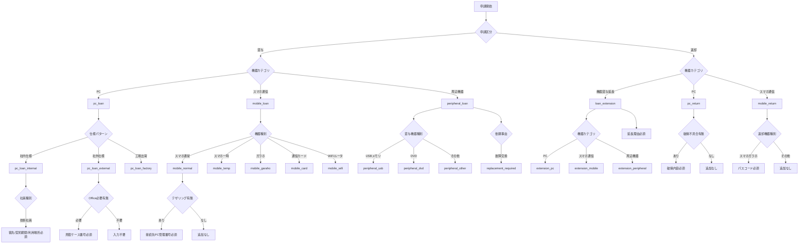

# 申請フォーム項目ツリー

> 元資料: `/home/ubuntu/申請項目一覧.md`  
> 目的: 申請時の入力漏れ防止と、フォーム分岐実装の共通仕様化

---

## 1. 全体ルート（最初の分岐）

1. 申請区分を選択
   - 貸与
   - 返却（機器貸与延長を含む）
2. 機器カテゴリを選択
   - PC
   - スマホ・通信機器
   - 周辺機器
3. 上記の組み合わせで画面フローを決定

---

## 2. 業務ツリー（人が読む用）

### 2-1. 貸与フロー

- 貸与
  - PC貸与
    - 共通項目入力
    - `仕様パターン` 分岐
      - 社内仕様
      - 社外仕様
      - 工場出荷（共通項目中心）
    - `社員種別` 分岐
      - 技術社員の場合、追加必須（客先/契約期間/機器利用場所）
    - `ノートPC` の場合
      - 追加モニタ有無の確認
    - `Office` 分岐
      - Office必要時は見積ケース番号必須（社外仕様等）
    - `派遣先要請` の場合
      - 覚書締結/承認確認へ分岐

  - スマホ・通信機器貸与
    - 共通項目入力
    - `機器種別` 分岐
      - スマホ（通常仕様）
      - スマホ（一時貸与）
      - ガラホ
      - 通信カード
      - Wi-Fiルータ
    - `社員種別=技術社員` の場合
      - 客先/契約期間/機器使用場所/テザリング等を追加
    - `テザリングあり` の場合
      - 接続先PC資産管理番号必須
    - `派遣先要請あり` の場合
      - 理由/覚書/承認を追加
    - `ガラホ` の場合
      - ガラホ選択理由を必須化

  - 周辺機器貸与
    - 共通項目入力
    - `貸与機器種別` 分岐
      - USBメモリ
      - DVDプレイヤー
      - その他周辺機器
    - `依頼事由` 分岐
      - 新規貸与
      - 故障交換
      - 障害対応
    - `社員種別=技術社員` の場合
      - 客先/契約期間/機器使用場所を追加
    - `USBメモリ` の場合
      - 接続PC管理番号/暗号化要否等を追加
    - `DVDプレイヤー` の場合
      - 読み書き要件を追加
    - `故障交換` の場合
      - 故障資産番号/CS番号等を追加

### 2-2. 返却フロー

- 返却
  - 機器貸与延長
    - 共通項目入力（対象機器番号/現在の貸与期限/延長後期限/延長理由）
    - `機器カテゴリ` 分岐
      - PC
      - スマホ・通信機器
      - 周辺機器
    - `客先利用/研修等で期限設定あり` の場合
      - 延長後利用終了予定日必須
    - `社外仕様PC` の場合
      - 延長理由詳細を必須化
  - PC返却
    - 共通項目入力（OIR番号/返却理由/発送日/伝票番号/付属品）
    - `破損・不具合あり` の場合
      - 破損内容（写真添付）必須
      - 落下/水こぼし等の場合はリスクマネジメント報告書ケース番号必須

  - スマホ・通信機器返却
    - 共通項目入力（機器種別/SP番号等/電話番号/返却理由/発送情報）
    - `機器種別=スマホ or ガラホ` の場合
      - 利用者パスコード必須

---

## 3. 実装ツリー（画面分岐用）

---

## 4. 条件付き必須ルール一覧（バリデーション実装用）

### 4-1. 貸与

- `loan + pc + employeeType=技術社員`  
  - 必須: `客先`, `契約期間`, `機器利用場所`

- `loan + pc + spec=社外仕様`  
  - 必須: `社外仕様PC必須理由`, `CYNCSプロジェクト番号`

- `loan + pc + officeNeeded=true`  
  - 必須: `Office見積取得ケース番号`

- `loan + pc + 派遣先要請`  
  - 必須: `覚書締結の有無`, `CSR推進部承認`

- `loan + mobile + employeeType=技術社員`  
  - 必須: `客先`, `契約期間`, `機器使用場所`, `メール利用有無`, `テザリング有無`, `使い回し予定`

- `loan + mobile + tethering=true`  
  - 必須: `テザリング接続PC資産管理番号`

- `loan + mobile + 派遣先要請=true`  
  - 必須: `貸与いただけない理由`, `CSR推進部承認`

- `loan + mobile + deviceType=ガラホ`  
  - 必須: `ガラホ選択理由`

- `loan + peripheral + employeeType=技術社員`  
  - 必須: `客先`, `契約期間`, `機器使用場所`

- `loan + peripheral + deviceType=USBメモリ`  
  - 必須: `利用用途`, `客先`, `利用期限`, `接続PC管理番号`, `暗号化要否`

- `loan + peripheral + deviceType=DVDプレイヤー`  
  - 必須: `利用用途`, `利用期限`, `読み込み/書き込み要件`
  - 条件付き必須: `employeeType=技術社員` の場合 `客先`

- `loan + peripheral + requestReason=故障交換`  
  - 必須: `故障機器資産管理番号`
  - 条件付き必須: `モニタ/ACアダプタ等` の場合 `CS番号`
  - 条件付き必須: `モニタ故障` の場合 `利用座席`

### 4-2. 返却

- `return + extension`  
  - 必須: `対象機器番号`, `現在の貸与期限`, `延長後利用終了予定日`, `延長理由`
  - 条件付き必須: `機器カテゴリ=PC and 仕様=社外仕様` の場合 `延長理由詳細`

- `return + pc`  
  - 必須: `OIR番号`, `返却理由`, `発送日`, `伝票番号`, `付属品有無`

- `return + pc + damage=true`  
  - 必須: `破損・不具合内容`
  - 条件付き必須: `落下/水こぼし等` の場合 `リスクマネジメント報告書ケース番号`

- `return + mobile`  
  - 必須: `機器種別`, `資産名`, `管理番号`, `返却理由`, `発送日`, `伝票番号`, `付属品有無`
  - 条件付き必須: `機器種別=スマホ or ガラホ` の場合 `利用者パスコード`

---

## 5. 入力不可/誘導ルール（業務制約）

- `送付先情報` は個人宅不可  
  - バリデーション: 住所判定ルールを実装（暫定は注意喚起 + 管理者レビュー）

---

## 6. 画面実装メモ（Step設計）

- Step 1: `申請区分` と `機器カテゴリ` を選択
- Step 2: 共通項目を表示
- Step 3: 分岐条件項目を表示（社員種別/仕様パターン/機器種別/依頼事由 等）
- Step 4: 条件付き必須項目を動的表示
- Step 5: 確認画面で「不足項目」「NG遷移」を明示
- Step 6: 送信（サーバー側で同一ルール再検証）

---

## 7. 分岐ID一覧（実装向け）

- `pc_loan_internal`
- `pc_loan_external`
- `pc_loan_factory`
- `pc_return`
- `loan_extension`
- `extension_pc`
- `extension_mobile`
- `extension_peripheral`
- `mobile_loan`
- `mobile_return`
- `peripheral_loan`

上記IDをフロント表示制御とAPIバリデーションで共通利用する。
